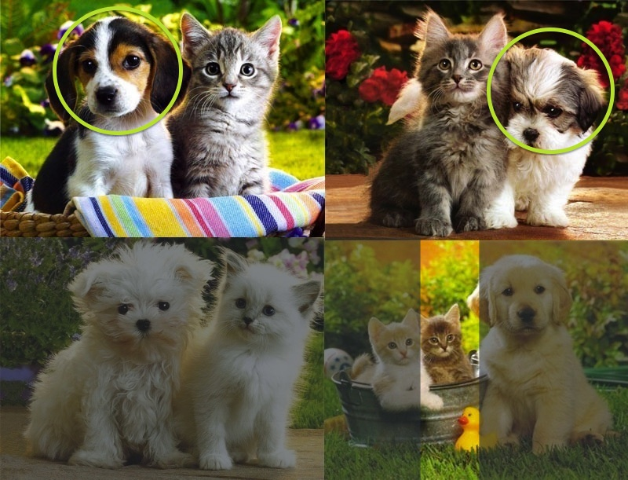

Text Mining & Naïve Bayes Classification
========================================================
author: Alessandro Gagliardi
date: February 24th, 2014

Last Time
========================================================
- Classification Problems
- Training/Test Sets & Cross-Validation
- K-Nearest Neighbor Classification  

### Questions?

Agenda
========================================================
0. Warmup
1. Intro to Probability
2. Naïve Bayes Classification
3. Spam Filter


Warmup
========================================================
type: section

The Problem
========================================================
You have a database of 100 emails.

* 60 of those 100 emails are spam
  * 48 of those 60 emails that are spam have the word "buy"
  * 12 of those 60 emails that are spam don't have the word "buy"
* 40 of those 100 emails aren't spam
  * 4 of those 40 emails that aren't spam have the word "buy"
  * 36 of those 40 emails that aren't spam don't have the word "buy"

What is the probability that an email is spam if it has the word "buy"? 

The Answer
========================================================
There are 48 emails that are spam and have the word "buy".
And there are 52 emails that have the word "buy": 48 that are spam plus 4 that aren't spam.
So the probability that an email is spam if it has the word "buy" is 48/52 = 0.92

If you understood this answer then you have understood the Bayes Theorem (in a nutshell) 

Intro to Probability
========================================================
type: section

Goals
========================================================
- What is a **probability**
- Different ways to project probability
- How Algebra helps us find Bayesian Inference

Sample Space
========================================================
incremental: true
Q. What do we call the space for all possible events?

A. This set is called the sample space $\Omega$.  
(e.g. the numbers 1 through 6 on a six-sided die)

All events (such as $A$) are included in this space

The probability of the sample space $P(\Omega)$ is 1.  

Intersecting Probabilities
========================================================
incremental: true
Q. Consider two events $A$ & $B$. How can we characterize the **intersection** of these events?

A. With the joint probability of $A$ and $B$, written $P(AB)$.

e.g.  
$P(A) =$ probability of being female  
$P(B) =$ probability of having long hair

$P(AB)$ = the probability of being female & having long hair 

Conditional Probability
========================================================
incremental: true
Q. Suppose event $B$ has occurred. What quantity represents the probability of $A$ given this information about $B$?

A. The intersection of $A$ & $B$ divided by region $B$.

This is called the conditional probability of $A$ given $B$:  

$$ P(A|B) = \frac{P(AB)}{P(B)} $$

Notice, with this we can also write $P(AB) = P(A|B) \times P(B)$.

probability with the help of small animals
========================================================
type: sub-section

Sample Space
========================================================


P(puppy) = 0.44
========================================================


P(dark) = 0.56
========================================================


P(puppy|dark) = P(puppy, dark) / P(dark)
========================================================


P(puppy|dark) = .22 / .56
========================================================


Independence
========================================================
incremental: true
Q. What does it mean for two events to be independent?  

A. Information about one does not affect the probability of the other.

This can be written as $P(A|B) = P(A)$.

Using the definition of the conditional probability, we can also write:

$$ P(A|B) = \frac{P(AB)}{P(B)} = P(A) \rightarrow   P(AB) = P(A) \times P(B) $$

Bayes’ Theorem
========================================================
incremental: true
$P(AB) = P(A|B) \times P(B)\qquad$

$P(BA) = P(B|A) \times P(A)\qquad$ by substitution

But $P(AB) = P(BA)\qquad$ since event $AB =$ event $BA$ 

$\hookrightarrow P(A|B) \times P(B) = P(B|A) \times P(A)\>$	by combining the above  

$\hookrightarrow P(A|B) = \frac{P(B|A) \times P(A)}{P(B)}\>$	by rearranging last step

Bayes’ Theorem
========================================================
type: prompt
This result is called **Bayes’ theorem**. Here it is again:
### $$ P(A|B) = \frac{P(B|A) \times P(A)}{P(B)} $$

Bayes’ Theorem
========================================================
incremental: true
Some facts:
- This is a simple algebraic relationship using elementary definitions.
- It’s interesting because it’s kind of a “wormhole” between two different “interpretations” of probability.
- It’s a very powerful computational tool.

Interpretations of Probability
========================================================
incremental: true
Briefly, the two interpretations can be described as follows:

The *frequentist interpretation* regards an event’s probability as its limiting frequency across a very large number of trials.

The *Bayesian interpretation* regards an event’s probability as a “degree of belief,” which can apply even to events that have not yet occurred.


Practice
========================================================
type: sub-section

Balls
========================================================
##### An Orange box has 3 balls: 2 white, and 1 black.
##### A Green box has 3 balls: 2 black, and 1 white.
###### 1. If I were to take a ball from a box, what's the probability that it came from the orange box?
###### 2. If I were to take a white ball from a box, what's the probability that it came from the orange box?
#### The Theorem again: $P(A|B) = \frac{P(B|A) \times P(A)}{P(B)}$
<aside class="notes">If P(A) is .5, and P(B) is .5, and P(B|A) = .66, then P(A|B) = .66</aside>

Balls 2
========================================================
##### An Orange box has 6 balls: 5 white, and 1 black.
##### A Green box has 3 balls: 2 black, and 1 white.
###### 1. If I were to take a ball from a box, what's the probability that it came from the orange box?
###### 2. If I were to take a white ball from a box, what's the probability that it came from the orange box?
#### The Theorem again: $P(A|B) = \frac{P(B|A) \times P(A)}{P(B)}$
<aside class="notes">If P(A) is 2/3, and P(B) is 2/3, and P(B|A) = 5/6, then P(A|B) = 5/6</aside>

Balls 3
========================================================
Go to [setosa.io/conditional](http://setosa.io/conditional/) and play.

Naïve Bayes Classification
========================================================
type: section

Goals:
========================================================
- Understand how our previous formula can be used as a Machine Learning algorithm
- Recognize the different parts of Naïve Bayesian Classification algorithm
- Be able to explain what makes this algorithm naïve

Bayesian Inference
========================================================
Suppose we have a dataset with features $x_1, \ldots, x_n$ and a class label $C$.  
What can we say about classification using Bayes’ theorem?

$$ P(C | x_1, \ldots, x_n) = \frac{P(x_1, \ldots, x_n | C) \times P(C)}{P(x_1, \ldots, x_n)} $$

Bayes’ theorem can help us to determine the probability of a record belonging to a class, *given* the data we observe.

Bayesian Inference
========================================================
$P(C | x_1, \ldots, x_n) = \frac{P(x_1, \ldots, x_n | C) \times P(C)}{P(x_1, \ldots, x_n)}$  

In plain English the above equation can be written as  

$$ \mbox{posterior} = \frac{\mbox{likelihood} \times \mbox{prior}}{\mbox{evidence}} $$

The Likelihood Function
========================================================
incremental: true
$P(x_1, \ldots, x_n | C)$ is our **likelihood function**. It represents the joint probability of observing features $x_1, \ldots, x_n$ given that that record belongs to class $C$.

We can observe the value of the likelihood function from the training data.

The Prior
========================================================
incremental: true
$P(C)$ is the **prior probability** of $C$. It represents the probability of a record belonging to class $C$ before the data is taken into account.

The value of the prior is also observed from the data.

The Normalization Constant
========================================================
incremental: true
$P(x_1, \ldots, x_n)$  is the **normalization constant**. It doesn’t depend on $C$, and is generally ignored until the end of the computation.

The normalization constant doesn’t tell us much.

The Posterior
========================================================
incremental: true
$P(C | x_1, \ldots, x_n)$ is the **posterior probability** of $C$. It represents the probability of a record belonging to class $C$ after the data is taken into account.

The goal of any Bayesian computation is to find ("learn") the posterior distribution of a particular variable.

Bayesian Inference
========================================================
The idea of Bayesian inference, then, is to *update* our beliefs about the distribution of $C$ using the data ("evidence") at our disposal.

$$ P(C | x_1, \ldots, x_n) = \frac{P(x_1, \ldots, x_n | C) \times P(C)}{P(x_1, \ldots, x_n)} $$

Then we can use the posterior for prediction.

Naïve Bayesian Classification
========================================================
Q. What piece of the puzzle we’ve seen so far looks like it could intractably difficult in practice?

Naïve Bayesian Classification
========================================================
incremental: true
Remember the likelihood function?  
$P(x_1, \ldots, x_n | C)$

Observing this exactly would require us to have enough data for every possible combination of features to make a reasonable estimate.

Naïve Bayesian Classification
========================================================
Q. What piece of the puzzle we’ve seen so far looks like it could intractably difficult in practice?

A. Estimating the full likelihood function.

Naïve Bayesian Classification
========================================================
incremental: true
Q. So what can we do about it?

A. Make a simplifying assumption. In particular, we assume that the features $x_1, \ldots, x_n$ are conditionally independent from each other:

$$ P(x_1, \ldots, x_n | C) \approx P(x_1 | C) \times P(x_2 | C) \times \ldots \times P(x_n|C) $$

This "naïve" assumption simplifies the likelihood function to make it tractable.

Spam Filters
========================================================
type: section

Goals
========================================================
- Preprocess Data
- Perform Naïve Bayes Classification

Text Mining
========================================================
Begin by installing R's Text Mining package:
```
install.packages('tm')
library(tm)
```

Email
========================================================
```
From 12a1mailbot1@web.de  Thu Aug 22 13:17:22 2002
Return-Path: <12a1mailbot1@web.de>
Delivered-To: zzzz@localhost.spamassassin.taint.org
Received: from localhost (localhost [127.0.0.1])
  by phobos.labs.spamassassin.taint.org (Postfix) with ESMTP id 136B943C32
	for <zzzz@localhost>; Thu, 22 Aug 2002 08:17:21 -0400 (EDT)
Received: from mail.webnote.net [193.120.211.219]
	by localhost with POP3 (fetchmail-5.9.0)
	for zzzz@localhost (single-drop); Thu, 22 Aug 2002 13:17:21 +0100 (IST)
Received: from dd_it7 ([210.97.77.167])
	by webnote.net (8.9.3/8.9.3) with ESMTP id NAA04623
	for <zzzz@spamassassin.taint.org>; Thu, 22 Aug 2002 13:09:41 +0100
From: 12a1mailbot1@web.de
Received: from r-smtp.korea.com - 203.122.2.197 by dd_it7  with Microsoft SMTPSVC(5.5.1775.675.6);
	 Sat, 24 Aug 2002 09:42:10 +0900
To: <dcek1a1@netsgo.com>
Subject: Life Insurance - Why Pay More?
Date: Wed, 21 Aug 2002 20:31:57 -1600
MIME-Version: 1.0
Message-ID: <0103c1042001882DD_IT7@dd_it7>
Content-Type: text/html; charset="iso-8859-1"
Content-Transfer-Encoding: quoted-printable
```

Read Text Lines
========================================================

```r
spam.path <- file.path("Classification_data", "spam")
p <- dir(spam.path)[1]
path <- file.path(spam.path, p)
con <- file(path, open = "rt", encoding = "latin1")
text <- readLines(con)
close(con)
head(text)
```

```
[1] "From 12a1mailbot1@web.de  Thu Aug 22 13:17:22 2002"                        
[2] "Return-Path: <12a1mailbot1@web.de>"                                        
[3] "Delivered-To: zzzz@localhost.spamassassin.taint.org"                       
[4] "Received: from localhost (localhost [127.0.0.1])"                          
[5] "\tby phobos.labs.spamassassin.taint.org (Postfix) with ESMTP id 136B943C32"
[6] "\tfor <zzzz@localhost>; Thu, 22 Aug 2002 08:17:21 -0400 (EDT)"             
```


Strip the Header
========================================================
The message always begins after the first full line break

```r
message.start <- which(text == "")[1] + 1
msg <- text[c(message.start:length(text))]
paste(msg, collapse = "\n")
```

```
[1] "<!DOCTYPE HTML PUBLIC \"-//W3C//DTD HTML 4.0 Transitional//EN\">\n<HTML><HEAD>\n<META content=3D\"text/html; charset=3Dwindows-1252\" http-equiv=3DContent-T=\nype>\n<META content=3D\"MSHTML 5.00.2314.1000\" name=3DGENERATOR></HEAD>\n<BODY><!-- Inserted by Calypso -->\n<TABLE border=3D0 cellPadding=3D0 cellSpacing=3D2 id=3D_CalyPrintHeader_ r=\nules=3Dnone \nstyle=3D\"COLOR: black; DISPLAY: none\" width=3D\"100%\">\n  <TBODY>\n  <TR>\n    <TD colSpan=3D3>\n      <HR color=3Dblack noShade SIZE=3D1>\n    </TD></TR></TD></TR>\n  <TR>\n    <TD colSpan=3D3>\n      <HR color=3Dblack noShade SIZE=3D1>\n    </TD></TR></TBODY></TABLE><!-- End Calypso --><!-- Inserted by Calypso=\n --><FONT \ncolor=3D#000000 face=3DVERDANA,ARIAL,HELVETICA size=3D-2><BR></FONT></TD><=\n/TR></TABLE><!-- End Calypso --><FONT color=3D#ff0000 \nface=3D\"Copperplate Gothic Bold\" size=3D5 PTSIZE=3D\"10\">\n<CENTER>Save up to 70% on Life Insurance.</CENTER></FONT><FONT color=3D#ff=\n0000 \nface=3D\"Copperplate Gothic Bold\" size=3D5 PTSIZE=3D\"10\">\n<CENTER>Why Spend More Than You Have To?\n<CENTER><FONT color=3D#ff0000 face=3D\"Copperplate Gothic Bold\" size=3D5 PT=\nSIZE=3D\"10\">\n<CENTER>Life Quote Savings\n<CENTER>\n<P align=3Dleft></P>\n<P align=3Dleft></P></FONT></U></I></B><BR></FONT></U></B></U></I>\n<P></P>\n<CENTER>\n<TABLE border=3D0 borderColor=3D#111111 cellPadding=3D0 cellSpacing=3D0 wi=\ndth=3D650>\n  <TBODY></TBODY></TABLE>\n<TABLE border=3D0 borderColor=3D#111111 cellPadding=3D5 cellSpacing=3D0 wi=\ndth=3D650>\n  <TBODY>\n  <TR>\n    <TD colSpan=3D2 width=3D\"35%\"><B><FONT face=3DVerdana size=3D4>Ensurin=\ng your \n      family's financial security is very important. Life Quote Savings ma=\nkes \n      buying life insurance simple and affordable. We Provide FREE Access =\nto The \n      Very Best Companies and The Lowest Rates.</FONT></B></TD></TR>\n  <TR>\n    <TD align=3Dmiddle vAlign=3Dtop width=3D\"18%\">\n      <TABLE borderColor=3D#111111 width=3D\"100%\">\n        <TBODY>\n        <TR>\n          <TD style=3D\"PADDING-LEFT: 5px; PADDING-RIGHT: 5px\" width=3D\"100=\n%\"><FONT \n            face=3DVerdana size=3D4><B>Life Quote Savings</B> is FAST, EAS=\nY and \n            SAVES you money! Let us help you get started with the best val=\nues in \n            the country on new coverage. You can SAVE hundreds or even tho=\nusands \n            of dollars by requesting a FREE quote from Lifequote Savings. =\nOur \n            service will take you less than 5 minutes to complete. Shop an=\nd \n            compare. SAVE up to 70% on all types of Life insurance! \n</FONT></TD></TR>\n        <TR><BR><BR>\n          <TD height=3D50 style=3D\"PADDING-LEFT: 5px; PADDING-RIGHT: 5px\" \n          width=3D\"100%\">\n            <P align=3Dcenter><B><FONT face=3DVerdana size=3D5><A \n            href=3D\"http://website.e365.cc/savequote/\">Click Here For Your=\n \n            Free Quote!</A></FONT></B></P></TD>\n          <P><FONT face=3DVerdana size=3D4><STRONG>\n          <CENTER>Protecting your family is the best investment you'll eve=\nr \n          make!<BR></B></TD></TR>\n        <TR><BR><BR></STRONG></FONT></TD></TR></TD></TR>\n        <TR></TR></TBODY></TABLE>\n      <P align=3Dleft><FONT face=3D\"Arial, Helvetica, sans-serif\" size=3D2=\n></FONT></P>\n      <P></P>\n      <CENTER><BR><BR><BR>\n      <P></P>\n      <P align=3Dleft><BR></B><BR><BR><BR><BR></P>\n      <P align=3Dcenter><BR></P>\n      <P align=3Dleft><BR></B><BR><BR></FONT>If you are in receipt of this=\n email \n      in error and/or wish to be removed from our list, <A \n      href=3D\"mailto:coins@btamail.net.cn\">PLEASE CLICK HERE</A> AND TYPE =\nREMOVE. If you \n      reside in any state which prohibits e-mail solicitations for insuran=\nce, \n      please disregard this \n      email.<BR></FONT><BR><BR><BR><BR><BR><BR><BR><BR><BR><BR><BR><BR><BR=\n><BR><BR><BR></FONT></P></CENTER></CENTER></TR></TBODY></TABLE></CENTER></=\nCENTER></CENTER></CENTER></CENTER></BODY></HTML>\n\n\n"
```


get.msg function
========================================================

```r
get.msg <- function(path)
{
  con <- file(path,"rt",encoding="latin1")
  text <- readLines(con)
  close(con)
  message.start <- which(text == "")[1]+1
  msg<-text[c(message.start:length(text))]
  return(paste(msg, collapse = "\n"))
} 
```


Get all the SPAM into a single vector
========================================================
incremental: true

```r
spam.docs <- dir(spam.path)
spam.docs <- spam.docs[
              which(spam.docs != "cmds")]
all.spam <- sapply(spam.docs,
  function(p)  # anonymous function
    get.msg(file.path(spam.path, p)))
```


* How do we turn these documents into feature vectors for classification?

Term-Document Matrix
========================================================
If one has the following two (short) documents: 

* D1 = "I like databases"  
* D2 = "I hate databases"  

then the term-document matrix would be:  

| | D1 | D2 |
|:-:|:-:|:-:|
| I | 1 | 1 |
| like | 1 | 0 |
| hate | 0 | 1 |
| databases | 1 | 1 |

Term-Document Matrix
========================================================
* `TermDocumentMatrix` takes two arguments: a `Corpus` object and a named list of control options.
    * a `Corpus` is constructed from a `Source`.  
For our purposes, our `Source` will be a `character vector`.
    * `control` allows us to:
        * remove punctuation
        * remove numbers
        * remove "*stopwords*"
        * add constraints (like `minDocFreq`)
    
stopwords
========================================================

from: [jmlr.org/papers/volume5/lewis04a/a11-smart-stop-list](http://jmlr.org/papers/volume5/lewis04a/a11-smart-stop-list/english.stop)  

```
i me my myself we our ours ourselves you your yours yourself yourselves he him his himself she her hers herself it its itself they them their theirs themselves what which who whom this that these those am is are was were be been being have has had having do does did doing would should could ought i'm you're he's she's it's we're they're i've you've we've they've i'd you'd he'd she'd we'd they'd i'll you'll he'll she'll we'll they'll isn't aren't wasn't weren't hasn't haven't hadn't doesn't don't didn't won't wouldn't shan't shouldn't can't cannot couldn't mustn't let's that's who's what's here's there's when's where's why's how's a an the and but if or because as until while of at by for with about against between into through during before after above below to from up down in out on off over under again further then once here there when where why how all any both each few more most other some such no nor not only own same so than too very
```


Term-Document Matrix
========================================================

```r
get.tdm <- function(doc.vec) {
 control <- list(stopwords = TRUE,
                 removePunctuation = TRUE,
                 removeNumbers = TRUE,
                 minDocFreq = 2)
 doc.source <- VectorSource(doc.vec)
 doc.corpus <- Corpus(doc.source)
 return(TermDocumentMatrix(doc.corpus, 
                           control))
}
```


Feature Set
========================================================
Create a data frame that provides the feature set from the training SPAM data

```r
spam.tdm <- get.tdm(all.spam)
spam.matrix <- as.matrix(spam.tdm)
spam.counts <- rowSums(spam.matrix)
spam.df <- data.frame(
                cbind(names(spam.counts),
                      spam.counts),
                stringsAsFactors = FALSE)
names(spam.df) <- c("term", "frequency")
spam.df$frequency <- as.numeric(
                        spam.df$frequency)
```


Feature Set
========================================================
Add `occurrance` & `density` features.

```r
spam.df$occurrence <- 
  sapply(1:nrow(spam.matrix),
         function(i) {
          length(
            which(spam.matrix[i, ] > 0)) / 
          ncol(spam.matrix)
        })
spam.df$density <- spam.df$frequency / 
               sum(spam.df$frequency)
```


Test
========================================================
Find terms that occur in both the test document and the training corpus

```r
test.path <- file.path("Classification_data", "spam_2")
test.docs <- dir(test.path)
test_email = file.path(test.path, test.docs[1])
msg <- get.msg(test_email)
msg.tdm <- get.tdm(msg)
msg.freq <- rowSums(as.matrix(msg.tdm))
msg.match <- intersect(names(msg.freq), spam.df$term)
length(msg.match) > 0
```

```
[1] TRUE
```


Prediction
========================================================
`prior` = $P(S) = .5$  
`match.probs` = $p(w_i|S)$  

```r
prior = 0.5  # assume 50% of email is spam
match.probs <- spam.df$occurrence[
                      match(msg.match, 
                            spam.df$term)]
prior * prod(match.probs)
```

```
[1] 1.435e-250
```

$$ P(S|D) = \frac{P(S)}{P(D)}\prod{p(w_i|S)} $$

Try it yourself!
========================================================
* `install.packages("tm")`
* Download dataset from [tinyurl.com/classification-data](http://tinyurl.com/classification-data)  
* Find the tm package pdf on CRAN and scan through the documentation. (google search "tm cran documentation")
* Download code from [tinyurl.com/classify-R](http://tinyurl.com/classify-R)  
* See how well you can follow the logic of how it works.  
* Find at least three functions in `tm` that are interesting. Write them down and explain them.
* `install.packages("e1071")` and try using `naiveBayes` on your own data.

Next Time
========================================================
type: section
Regression & Regularization
-------------------
